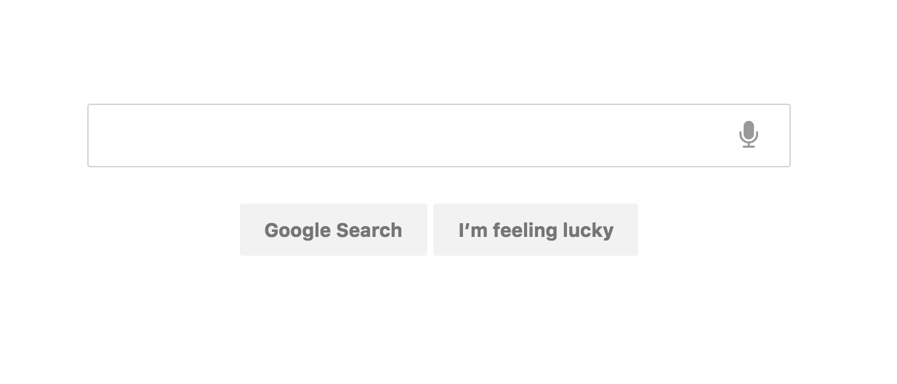

# Google Search

## Steps

### Git and GitHub

- Create a repo called `activity--google-search`.
- Upload all files to GitHub and send that link in Trello Card.

## Design Specs

- Icons using Font Awesome CDN.
- Try using `fa-microphone` as icon.

```
Search Input
  dimensions: 484px * 44px
  border color: rgba(0, 0, 0, 0.16)
  corner radius: 2px
Icon
  text size: 20px
  text color: rgba(0, 0, 0, 0.4)
  dimensions: 56px * auto
Buttons
  36px height
  border color: #F2F2F2
  fill color: #F2F2F2
  text size: 13px
  text style: bold
  space between content and borders: 0 16px
Space between input and buttons: 25px
```

## Final Result


